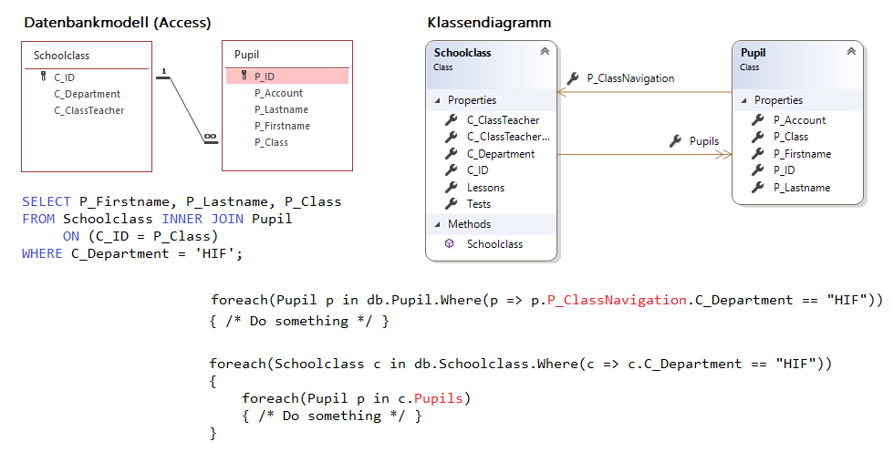

# Query Syntax und Objektgraphen

## Datenbankmodell vs. Objektmodell
Bereits zu Beginn der objektorientierten Programmierung wird jeder mit der Beziehung zwischen 2 
Klassen konfrontiert. Es handelt sich meist um eine *Assotiation* und gibt an, dass eine Klasse
eine Andere als Member verwendet.

In Datenbanken gibt es auch Beziehungen zwischen Tabellen. Hier ist es ein Primärschlüssel, der
in anderen Tabellen als Fremdschlüssel verwendet wird, um auf einen Datensatz zu verweisen.

### Abbilden von Beziehungen: Navigations
Diese Ideen sind oberflächlich betrachtet nicht unähnlich. Gerade die Beziehungen in einer relationalen
Datenbank können leicht in der objektorientierten Programmierung nachgebildet werden. Folgendes
Beispiel zeigt eine klassische 1:n Beziehung zwischen zwei Tabellen und eine Assotiation zwischen
2 Klassen.



Die Klassen *Schoolckass* und *Pupil* haben nur datenhaltende Properties und werden als *POCO Klassen* 
(Plain old CLR objects) bezeichnet. Analog gibt es in der Java Welt auch den Begriff *POJO*.

Beide Klassen haben ein *Navigation Property*. In der Klasse *Schoolclass* gibt es eine Collection von
Schülern mit dem Namen *Pupils* (da eine Klasse n Schüler haben kann). Umgekehrt gibt es in der Klasse
*Pupil* einen Verweis auf die Klasse mit dem Namen *P_ClassNavigation*. Da dies die andere Seite der
Beziehung ist, ist das natürlich ein einzelnes Feld und keine Liste.


### Generierung der Modelklassen: Der OR Mapper
Da die Abbildung eines Datenbankmodells in Klassen mechanische Tipparbeit ist, gibt es fertige
Bibliotheken, die diese Klassen anhand einer gegebenen Datenbank generieren: Object-relational Mapper
oder OR Mapper erlauben einen objektorientierten Zugriff auf eine Datenbank. In .NET heißt
der verwendete OR Mapper *Entity Framework*.

## Modell der Tests Datenbank
Die folgenden Beispiele basieren auf einer kleinen Datenbank, in der Lehrer ihre Tests, die sie in
den Klassen haben, erfassen können. Die Schüler können dann darauf zugreifen. Das Modell sieht so
aus:


Aus diesem Datenbankdiagramm wurde folgender Objektgraph erzeugt, der mittels Navigation Properties
verbunden ist:


## Query Syntax
Mit C# 3 wurde nicht nur LINQ im Rahmen von Extension Methods des Interfaces *IEnumerable* eingeführt.
Es wurde auch eine eigene Syntax geschaffen, um Objektgraphen SQL ähnlich abzufragen. Folgende
Abbildung zeigt den Vergleich der *Method Syntax* und der *Query Syntax*:


- Die *from* Klausel entspricht einer *foreach* Schleife und definiert eine Variable, in der das
  aktuelle Element der Collection (hier *p*) geschrieben wird. Sie ist - im Gegensatz zu SQL - die erste Anweisung.
- Die *where* Klausel filtert - wie in SQL - Inhalte. Sie muss allerdings in C# Syntax geschrieben
  werden, SQL Operatoren wie *AND*, *OR* sowie der Vergleich mit einfachem *=* sind nicht möglich.
- Am Ende muss immer ein *select* stehen und darf - auch wenn nichts verändert wird - nicht 
  weggelassen werden. Im einfachsten Fall liefert das Select das Element (also *p*)
  wieder zurück. In diesem Beispiel wird *Pupil* auf einen neuen Typ projiziert.

### Kombination von Query und Method Syntax
Es stellt sich natürlich bei vielen die Frage, was nun "besser" ist. Der gute .NET Programmiert
beide Formen, denn diese haben unterschiedliche Stärken.

- Die CLR kennt nur Methodenaufrufe, daher wird die Query Syntax vom Compiler in die
  Extension Methoden übersetzt.
- Die Method Syntax ist "näher am Compiler", der Programmablauf ist klar nachvollziehbar.
- Die Method Syntax erfordert kein *from* und *select* und ist für reine Filterungen oft die kürzeste Form.
- Mit der Method Syntax können alle LINQ Funktionen genutzt werden.
- Die Query Syntax ist bei längeren Abfragen leichter zu lesen. Es müssen keine Lambdas verwendet
  werden.
- Kompliziertere Abfragen mit Gruppierungen, Sortierungen oder Joins sind in der Query Syntax
  leichter zu schreiben und zu lesen.
- Beim Kompilieren der Query Syntax erstellt der Compiler manchmal zusätzliche Aufrufe wie
  *Include()* bei Datenbanken, die in der Method Syntax händisch geschrieben werden müssen.

Da die Query Syntax immer Ergebnisse vom Typ *IEnumerable* liefert, können diese Ergebnisse mit
der Method Syntax weiterverarbeitet werden.

## Beispiele
### Zeige alle Schüler der 3BHIF.
```c#
IEnumerable<Pupil> demo1 = from p in data.Pupil
                           where p.P_Class == "3BHIF"
                           select p;
// Alternative mit Method Syntax:
demo1 = data.Pupil.Where(p => p.P_Class == "3BHIF");
```

### Wann findet der letzte Test statt?
```c#
// Die Query Syntax liefert ein IEnumerable<DateTime>, welches mit weiteren Methoden
// in der Method Syntax weiterverarbeitet werden kann.
DateTime lastTest = (from t in data.Test
                     select t.TE_Date).Max();
```

### Gib die Anzahl der Tests jedes Klassenvorstandes der HIF und AIF Klassen aus.
```c#
// Vorsicht: C_ClassTeacher ist NULLABLE und die 2DAIF hat keinen KV. Daher verwenden
//           wir c.C_ClassTeacherNavigation?
var demo2 = from c in data.Schoolclass
            where c.C_Department == "HIF" || c.C_Department == "AIF"
            orderby c.C_Department, c.C_ID
            select new
            {
                Class = c.C_ID,
                Teacher = c.C_ClassTeacher,
                Name = c.C_ClassTeacherNavigation?.T_Lastname,
                TestCount = c.C_ClassTeacherNavigation?.Tests.Count()
            };
// Alternative mit Method Syntax:
demo2 = data.Schoolclass
    .Where(c => c.C_Department == "HIF" || c.C_Department == "AIF")
    .OrderBy(c => c.C_Department)
    .ThenBy(c => c.C_ID)
    .Select(c => new
    {
        Class = c.C_ID,
        Teacher = c.C_ClassTeacher,
        Name = c.C_ClassTeacherNavigation?.T_Lastname,
        TestCount = c.C_ClassTeacherNavigation?.Tests.Count()
    });
```

### Gib die Klassen über 30 Schüler aus.
```c#
// Mit let können wir Zwischenwerte speichern, damit nicht mehrmals abgefragt werden 
// muss. Das ist besonders bei hierarchischen Objekten hilfreich.
var demo3 = from c in data.Schoolclass
            let count = c.Pupils.Count()
            where count > 30
            select new
            {
                Class = c.C_ID,
                ClassCount = count
            };
```

## Übung
Öffne die Datei *QuerySyntax.sln* und löse die Aufgaben in der Datei *Program.cs* mit Hilfe der 
Query Syntax von LINQ. Verwende zum 
Speichern deiner Abfragen die Variablen *result1* - *result10*. Die korrekte Ausgabe ist bei jedem
Übungsbeispiel als Kommentar enthalten.
