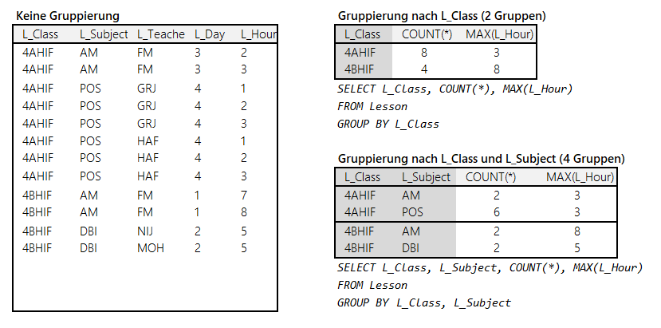

<!-- markdownlint-disable MD045 -->
# Join und Gruppierungen

## Join über Navigation Properties

In Datenbanken ist es üblich, mehrere Tabellen zu verknüpfen. Möchten wir z. B. eine Liste aller
Schüler mit ihrem Klassenvorstand und der Abteilung ausgeben, so wird dies in SQL mit der *JOIN*
Klausel ausgeführt:

```sql
SELECT C_Department, C_ID, C_ClassTeacher, P_Lastname, P_Firstname
FROM Schoolclass INNER JOIN Pupil ON (C_ID = P_Class)
ORDER BY C_Department, C_ID, P_Lastname, P_Firstname;
```

Das Ergebnis ist eine flache Tabelle:

| C_Department | C_ID  | C_ClassTeacher | P_Lastname  | P_Firstname  |
| ------------ | ----- | -------------- | ----------- | ------------ |
| HIF          | 1AHIF | NIJ            | Aktas       | Nilsu        |
| HIF          | 1AHIF | NIJ            | Beslic      | Laura        |
| HIF          | 1AHIF | NIJ            | Bice        | Melek        |
| HIF          | 1AHIF | NIJ            | Bleier      | Sarah        |
| HIF          | 1AHIF | NIJ            | Breitwieser | Michelle-Lea |
| HIF          | 1AHIF | NIJ            | Brodkorb    | Ilaria       |
| HIF          | 1AHIF | NIJ            | El Ibrahim  | Jasmin       |

In LINQ könnten wir folgendes Statement schreiben:

```c#
from p in data.Pupil
select new
{
    p.P_ClassNavigation.C_Department,
    p.P_ClassNavigation.C_ID,
    p.P_ClassNavigation.C_ClassTeacher,
    p.P_Lastname,
    p.P_Firstname
};
```

Dies setzt allerdings voraus, dass eine Navigation zwischen *Pupil* und *Schoolclass* (hier
*P_ClassNavigation* existiert). Falls wir allerdings nur eine einseitige Navigation in Form einer
Liste zwischen den Klassen haben (*Pupils*), können wir unser LINQ Statement auch so schreiben:

```c#
from c in data.Schoolclass
from p in c.Pupils
select new
{
    c.C_Department,
    c.C_ID,
    c.C_ClassTeacher,
    p.P_Lastname,
    p.P_Firstname
};
```

Wichtig ist hier die Verwendung von *c.Pupils* in der zweiten *from* Klausel. Durch diesen Ausdruck
wird das Join Kriterium in SQL realisiert. Es entspricht zwei geschachtelten *foreach* Schleifen:

```c#
foreach (Schoolclass c in data.Schoolclass)
    foreach(Pupil p in c.Pupils)
    { /* Do something */}
```

Ein häufiger Fehler ist folgendes Konstrukt:

```c#
from c in data.Schoolclass
from p in data.Pupil          // Hier werden alle Schüler abgefragt
select new
{
    c.C_Department,
    c.C_ID,
    c.C_ClassTeacher,
    p.P_Lastname,
    p.P_Firstname
};
```

Hier wird für jede Klasse jeder Schüler, und zwar unabhängig seiner Klasse, zurückgegeben. Es
entspricht dem *CROSS JOIN* und gibt n x m Datensätze zurück.

### Der händische Join in LINQ

Wir haben bis jetzt Navigations benutzt, um die Instanzen zu verknüpfen. Falls keine Navigations
vorhanden sind, gibt es in LINQ auch den Join Ausdruck. Etwas gewöhnungsbedürftig ist hier das
Verwenden von equals statt dem C# Vergleichsoperator (*==*).

```c#
from c in data.Schoolclass
join p in data.Pupil on c.C_ID equals p.P_Class
select new
{
    c.C_Department,
    c.C_ID,
    c.C_ClassTeacher,
    p.P_Lastname,
    p.P_Firstname
};
```

## Gruppierungen

### Gruppierung in SQL

In SQL gibt es mit der *GROUP BY* Klausel die Möglichkeit, die Daten in Gruppen zu unterteilen.
Betrachten wir unsere Tabelle *Lesson*. Wir können nach verschiedenen Kriterien gruppieren:


Der Zweck von Gruppierungen ist meist das Aggregieren von Daten. In SQL stehen uns die
Aggregatfunktionen *COUNT()*, *MAX()*, *MIN()*, ... zur Verfügung. Diese werden dann pro Gruppe von der
Datenbank ausgewertet:



> **Hinweis:** Natürlich kann nach einer Gruppierung nicht mehr auf die einzelnen Werte zugegriffen
> werden, die nicht Teil der Gruppierung sind. Viele versuchen verzweifelt, bei einer Gruppierung
> nach der Klasse noch den Gegenstand auszugeben. Das kann natürlich nicht funktionieren, da alle
> Datensätze der Klasse bereits zu einem Wert zusammengefasst wurden. Werte, nach denen nicht gruppiert
> wird, müssen immer in einer Aggregatsfunktion stehen.

### Gruppierung in LINQ

Nach diesem Ausflug in SQL sehen wir uns die Implementierung in LINQ an.

#### Technische Umsetzung mit IGrouping

Im Namespace *System.Linq* ist ein Interface *IGrouping* definiert, welches folgende Eigenschaften
hat:

```c#
public interface IGrouping<out TKey, out TElement> : IEnumerable<TElement>, IEnumerable
{
    TKey Key { get; }
}
```

Dieses Interface erweitert offensichtlich eine normale Collection (IEnumerable) um ein Property Key.
In diesem Property ist der Wert, nach dem gruppiert wird gespeichert. Ein konkretes Beispiel erklärt
den Einsatz am Besten:

```c#
from l in data.Lesson
group l by l.L_Class into g
select new
{
    Class   = g.Key,
    Count   = g.Count(),
    MaxHour = g.Max(x => x.L_Hour)
};
```

Verwirrend ist hier der Einsatz der Gruppierungsvariable *g*. Sie ist eine Instanz von IGrouping und
somit kann über das Property *Key* auf den Gruppierungsschlüssel zugegriffen werden. Möchte man auf
die Werte in der Gruppe zugreifen, wird einfach g verwendet. Dadurch funktioniert der Ausdruck
*g.Max(x => x.L_Hour)* und liefert die letzte Stunde pro Klasse.


Natürlich kann hier auch nicht auf einzelne Werte zugegriffen werden, denn *g.L_Teacher* wird nicht
funktionieren, da *g* ja eine Collection ist.

Möchte man nach mehreren Spalten gruppieren, wird mit *new* ein neuer Typ erzeugt:

```c#
from l in data.Lesson
group l by new { l.L_Class, l.L_Subject } into g
select new
{
    Class   = g.Key.L_Class,
    Subject = g.Key.L_Subject,
    Count   = g.Count(),
    MaxHour = g.Max(x => x.L_Hour)
};
```

## Übungen


