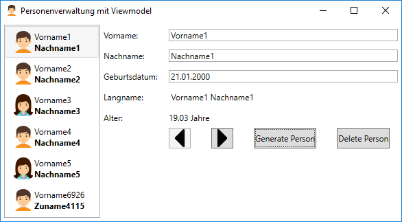

# Listen in XAML


In diesem Beispiel sollen alle Personen in einer Liste dargestellt werden. Beim Klicken auf einen
Eintrag der Liste werden die Daten geladen. Diese Features werden durch eine *ListBox* bereitgestellt.
Da Person ein komplexer Typ ist, muss über ein *DataTemplate* die Anzeige in der ListBox gesteuert werden.
Folgendes Beispiel zeigt *Firstname* und *Lastname* untereinander an:

```xml
<ListBox DockPanel.Dock="Left" ItemsSource="{Binding Persons}" SelectedItem="{Binding CurrentPerson}">
    <ListBox.ItemTemplate>
        <DataTemplate>
            <DockPanel Margin="5 5 5 5">
                <StackPanel>
                    <TextBlock Text="{Binding Firstname}" />
                    <TextBlock FontWeight="Bold" Text="{Binding Lastname}" />
                </StackPanel>
            </DockPanel>
        </DataTemplate>
    </ListBox.ItemTemplate>
</ListBox>
```

Dabei ist *Persons* die Collection von Personen in *MainViewModel*, *CurrentPerson* ist das Property in
*MainViewModel*, in welches die Liste die aktuell ausgewählte Person hineinschreibt. Es muss natürlich
daher ein public set Property sein.

Für die Darstellung von Listen gibt es in WPF mehrere Controls:

*<sup>Quelle: http://www.sws.bfh.ch/~amrhein/Skripten/Info2/, Kapitel 8: WPF Listen und Tabellen</sup>*

## Erstellen der Collection mittels LINQ Abfrage aus dem Model
Hier wird in *get* des Properties eine LINQ Abfrage geschrieben, die die Daten aus dem Model holt. Gegebenenfalls
muss mit *ToList()* die Ausführung erzwungen werden, damit z. B. die Daten aus der Datenbank gelesen werden.

In unserem Beispiel wird dies mittels folgendem Properties erledigt:
```c#
public IList<Person> Persons => personDb.Persons.ToList();
```

Werden nun die zugrundeliegenden Daten über die GUI geändert (hinzufügen oder löschen von Elementen), 
muss über *PropertyChanged()* die Liste neu eingelesen werden. Bei einer Änderung der Objekte selbst wird 
die Änderung sofort dargestellt, da es sich bei der Liste nur um Referenzen auf die Originalobjekte 
handelt. Dennoch muss folgendes beachtet werden:
- Der Aufruf von *PropertyChanged()* muss immer beim Hinzufügen oder Löschen erfolgen, um eine konsistente 
  Darstellung zu gewährleisten.
- *PropertyChanged()* liest die Liste zur Gänze neu ein. Bei einer langsamen Quelle (z. B. einem Webservice)
  kann hier eine Latenz für den Anwender entstehen, vor allem wenn sehr häufig Objekte manipuliert werden.

In unserem Beispiel wird das Einfügen eines Datensatzes in *GeneratePersonCommand* durchgeführt:
```cs
GeneratePersonCommand = new RelayCommand(
    () =>
    {
        Random rnd = new Random();
        personDb.Persons.Add(new Person
        {
            Firstname = $"Vorname{rnd.Next(1000, 9999 + 1)}",
            Lastname = $"Zuname{rnd.Next(1000, 9999 + 1)}",
            Sex = rnd.Next(0, 2) == 0 ? Sex.Male : Sex.Female,
            DateOfBirth = DateTime.Now.AddDays(-rnd.Next(18 * 365, 25 * 365))
        });
        // Bewirkt das neue Auslesen der Liste.
        PropertyChanged(this, new PropertyChangedEventArgs(nameof(Persons)));
    });
```
