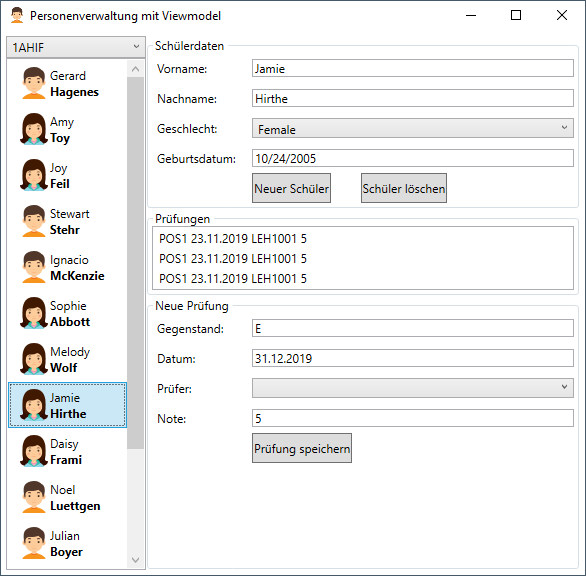
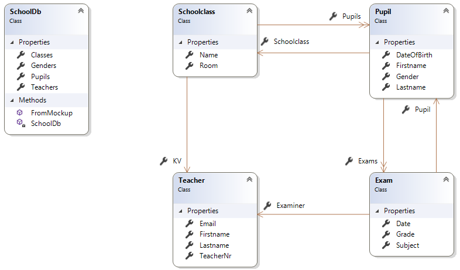
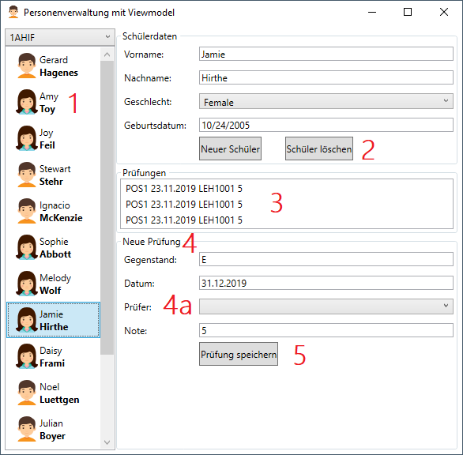

# Listen in XAML



## Grundsätzliches

Oft sollen Collections in der Benutzeroberfläche dargestellt werden. Dies entsteht oft bei folgenden
Situationen:

- Eine Dropdownliste zur Filterung soll angezeigt werden.
- Eine Liste von Objekten soll zur Navigation angezeigt werden.
- Eine Liste von möglichen Werten soll in einem Eingabeformular angezeigt werden (z. B. männlich/weiblich).

Für die Darstellung von Listen gibt es in WPF mehrere Controls:


*<sup>Quelle: http://www.sws.bfh.ch/~amrhein/Skripten/Info2/, Kapitel 8: WPF Listen und Tabellen</sup>*

## Klassendiagramm der Model Klassen

Zur Demonstration werden Musterdaten generiert, die Schulklassen samt Schüler und Prüfungen
beinhalten:



## Die Combo Box (Dropdownliste)

In einer Combobox kann der Benutzer einen Wert auswählen. Dabei kann ein Standardwert gesetzt werden,
der beim Starten der Applikation gesetzt wird.

### Binding mit *ItemsSource* und *SelectedValue*

Die Combobox bezieht ihre Werte über die Eigenschaft *ItemsSource*. Sie verweist auf eine Liste im
ViewModel. Dort muss diese Liste als public Property vom Typ *IEnumerable&lt;T&gt;* (oder ein
abgeleiteter Typ wie *ICollection* oder *List*) definiert sein. Da meist komplexe Datentypen
verwendet werden
(Entityklassen wie *Pupil*, *Taecher*, ...) muss mit der Eigenschaft *DisplayMemberPath* festgelegt
werden, welches Property dieser Klasse dem Benutzer angezeigt wird.

Wählt der Benutzer nun ein Element aus, wird das Property, welches über die Eigenschaft
*SelectedValue* gebunden ist, gesetzt. Dies muss im ViewModel natürlich einen public setter haben
und vom gleichen Typ wie die Listenelemente sein. Soll nur ein Property des Listenelementes
zurückgeschrieben werden, gibt es mit der Eigenschaft *SelectedValuePath* noch die Möglichkeit,
das zurückgeschriebene Property des Listenelements zu definieren.

Mit *SelectedIndex* kann z. B. das erste Element beim Start ausgewählt werden. Das Standardverhalten
ist kein ausgewählter Wert (leerer Eintrag).

### Definition in XAML

In unserem Musterprogramm ist die ComboBox, die die Liste aller Klassen für die Filterung darstellt,
so definiert:

```xml
<ComboBox x:Name="Classlist" SelectedIndex="0" DockPanel.Dock="Top"
          SelectedValue="{Binding CurrentClass}" ItemsSource="{Binding Classes}"
          DisplayMemberPath="Name"/>
```

In [MainViewModel](ListDemo/ViewModels/MainViewModel.cs) wird das Property Classes vom Typ
`List<Schoolclass>` definiert. Das Property *CurrentClass* hat dementsprechend den Typ *Schoolclass*,
damit es das gewählte Listenelement aufnehmen kann. Der setter regelt dann die Aktualisierung der
angezeigten Schüler.

```c#
public List<Schoolclass> Classes => _db.Classes;

private Schoolclass _currentClass;
public Schoolclass CurrentClass
{
    get => _currentClass;
    set
    {
        _currentClass = value;
        Pupils.ReplaceAll(_currentClass?.Pupils);
    }
}
```

## Die List Box

Für die Auflistung der Schüler wird in unserem Musterprogramm eine ListBox definiert. Eine ListBox
ist durch ihre Features ein sehr vielseitiges und daher häufig verwendetes Control:

- Sie kann horizontal oder vertikal wachsen.
- Die Darstellung der einzelnen Zelle kann durch ein Data Template beliebig definiert werden.
- Sie kann in Verbindung mit einer *ObservableCollection* automatisch aktualisiert werden.

### Binding mit *ItemsSource* und *SelectedValue*

Auch eine ListBox hat die für das Binding an das ViewModel notwendigen Eigenschaften: *ItemsSource*
und *SelectedValue*. Ihre Bedeutung ist wie bei der ComboBox.

### Definition in XAML mit Data Templates

Eine Liste wird in der Regel für die Anzeige von Collections komplexer Typen (Entities) verwendet.
Da die Liste selbst nicht weiß, wie sie z. B. die Klasse *Pupil* darstellen soll, wird ohne unser
Zutun die *ToString()* Methode aufgerufen. Die liefert allerdings nur den Typnamen, was wenig sinnvoll
ist.

Wollen wir steuern, wie der einzelne Schüler in unserem Musterprogramm dargestellt wird, können wir
das über ein *DataTemplate* definieren.

Eine vereinfachte Definition der Liste samt Data Template aus unserem Programm zeigt der folgende
Code:

```xml
<ListBox MinWidth="140" ItemsSource="{Binding Pupils}" SelectedValue="{Binding CurrentPupil}">
    <ListBox.ItemTemplate>
        <DataTemplate>
            <!-- Alle Bindings gelten für das aktuelle Pupil Objekt. -->
            <StackPanel>
                <TextBlock Text="{Binding Firstname}" />
                <TextBlock FontWeight="Bold" Text="{Binding Lastname}" />
            </StackPanel>
        </DataTemplate>
    </ListBox.ItemTemplate>
</ListBox>
```

Beachte, dass innerhalb des Data Templates direkt auf die Properties von *Pupil* zugegriffen werden
kann. Es wirkt quasi wie eine *foreach* Schleife, die durch die einzelnen Elemente iteriert und das
aktuelle Element in einer Variablen bereitstellt.

**Zusatzinfo: Buttons in Listen**

Soll ein Button in eine Liste eingebaut werden, der ein Command des ViewModels aufruft,
muss zuerst dem Window mit *x:Name* ein Name gegeben werden (z. B. *MainWindowPage*). Dann kann im Data
Template ein Button definiert werden, der das Command *DeleteItem* aufruft und den aktuellen Datensatz
übergibt:

```xml
<Button Content="Delete"
        Command="{Binding Source={x:Reference MainWindowPage}, Path=BindingContext.DeleteItem}"
        CommandParameter="{Binding .}" />
```

### Verwendung einer *ObservableCollection*

Wird bei einer normalen Liste ein Element hinzugefügt oder gelöscht, bekommt die ListBox nichts
davon mit. Wird hingegen eine *ObservableCollection* verwendet, wird beim Aufrufen der *Add()* oder
*Remove()* Methode die ListBox automatisch aktualisiert.

Das ist deswegen notwendig, da sich die Liste beim Anlegen oder Löschen eines Schülers verändert.
Außerdem wird beim Wechsel der Klasse die Liste neu befüllt.

> **Wichtig:** Observable Collections arbeiten nur richtig, wenn mit der gleichen Instanz gearbeitet
> wird. Ein häufiger Fehler ist das Erstellen einer neuen Observable Collection mit *new*.

In [MainViewModel](ListDemo/ViewModels/MainViewModel.cs) werden die Properties *Pupils* und
*CurrentClass* so definiert:

```c#
using System.Collections.ObjectModel;
using ListDemo.Extensions;

...

public ObservableCollection<Pupil> Pupils { get; } = new ObservableCollection<Pupil>();
private Schoolclass _currentClass;
public Schoolclass CurrentClass
{
    get => _currentClass;
    set
    {
        _currentClass = value;
        Pupils.ReplaceAll(_currentClass?.Pupils);
    }
}
```

Die Methoden *AddRange()* und *ReplaceAll()* gibt es nicht im Framework, sie wurden als Extension
Methoden in [ObservableCollectionExtensions](ListDemo/Extensions/ObservableCollectionExtensions.cs)
selbst hinzugefügt.

## Übung

Erweitere die bestehende Solution [ListDemo](ListDemo/ListDemo.sln) um die folgenden Punkte:



1. Zeige in der Liste nicht nur den Schülernamen, sondern auch den Namen des Klassenvorstandes an.
2. Der Button *Schüler löschen* ist noch ohne Funktion. Beim Drücken darauf soll der aktuelle Schüler
   entfernt werden. Achte darauf, dass er aus der ListBox, aus der *Pupils* Collection der Datenbank
   und der *Pupils* Collection der aktuellen Klassen entfernt wird.
3. In XAML Code haben die Prüfungen noch statische Werte zur Demonstration. Gestalte die ListBox
   so, dass der Prüfungsgegenstand, das Datum der Prüfung, das Lehrerkürzel und die Note nett
   aufbereitet ausgegeben werden.
4. Der Bereich *Neue Prüfung* besteht im Moment noch aus Textboxen ohne Binding. Erzeuge die
   entsprechenden Bindings und die benötigten Properties im ViewModel.

   (a) Der Prüfer soll aus einer Liste von Lehrern gewählt werden, die über die Datenbank
   bereitgestellt wird.
5. Beim Klicken auf Prüfung speichern soll die Prüfung zur Liste der Prüfungen des Schülers
   hinzugefügt werden. Achte auch darauf, dass sich die Liste der Prüfungen sofort aktualisiert.
