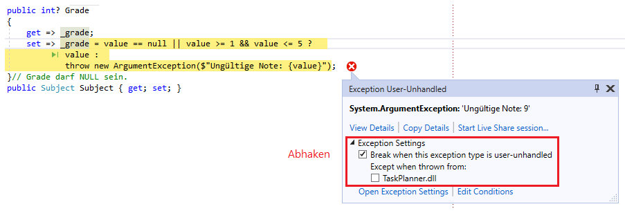

# Validation mit WPF und MVVM

Es gibt mehrere Möglichkeiten, Eingaben in WPF mit MVVM zu validieren:

- Werfen einer Exception in der Programmlogik.
- Das ViewModel implementiert das Interface *INotifyDataErrorInfo*.

## Vorbereitung: Umgang mit NULL Werten

Da wir in Textfeldern, die an nullable Properties gebunden sind, auch null Werte erlauben müssen, brauchen
wir zuerst einen Converter. Ohne diesen Converter würden nämlich leere Eingaben die Validierung nicht
bestehen.

Der folgende Converter wandelt null Werte in der Datenbank in Leerstrings um. Der (wichtigere) Rückweg
wandelt den Leerstring in einen null Wert um. Ohne diesen Converter würde versucht werden, den
Leerstring in eine Zahl zu konvertieren, was fehlschlägt.

```c#
public class EmptyToNullConverter : IValueConverter
{
    // Wird aufgerufen, wenn ein Wert aus der DB im Textfeld angezeigt wird.
    public object Convert(object value, Type targetType, object parameter, System.Globalization.CultureInfo culture)
    {
        return value == null ? "" : value;
    }

    // Wird aufgerufen, wenn ein Wert aus dem Textfeld in die DB geschrieben werden soll.
    public object ConvertBack(object value, Type targetType, object parameter, System.Globalization.CultureInfo culture)
    {
        return string.IsNullOrEmpty(value.ToString()) ? null : value;
    }
}
```

In XAML wird der Converter als Ressource definiert.

```xml
<Window x:Class="TaskPlanner.MainWindow" xmlns:local="clr-namespace:TaskPlanner" ...>
    <Window.Resources>
        <local:EmptyToNullConverter x:Key="EmptyToNullConverter" />
    </Window.Resources>

    ...

    <TextBox Text="{Binding CurrentTask.Grade, Converter={StaticResource EmptyToNullConverter}}" />
```

## Der einfachste Ansatz der Validierung: Werfen von Exceptions

### set Methode in den Modelklassen

Wollen wir bestimmte Werte in den Modelklassen verhindern, so schreiben wir einfach eine eigene
set Methode. Diese Methode wirft eine Exception, falls der Wert nicht gespeichert werden darf.
Beachte, dass ggf. der Wert *null* auch erlaubt werden muss.

Hinweis: EF Core schreibt beim Befüllen "direkt" den Wert in die Instanz. Das bedeutet, dass
in der Datenbank vorhandene ungültige Werte durchaus als Wert vorkommen können.

```c#
public class Task
{
    public int Id { get; set; }             // Wird automatisch zum PK und Autoincrement, da es ein int ist.
    public DateTime Start { get; set; }
    public DateTime End { get; set; }
    private int? _grade;                   // Grade darf NULL sein.
    public int? Grade
    {
        get => _grade;
        set => _grade = value == null || value >= 1 && value <= 5 ?  
                value :
                throw new ArgumentException($"Ungültige Note: {value}");
    }
    public Subject Subject { get; set; }
}
```

### Setzen der Bindingoptionen in XAML

In XAML muss die Validierung noch aktiviert werden. Dafür wird im Binding die Option
*ValidatesOnExceptions* auf *True* gesetzt. Außerdem kann noch mit einem Error Template die Anzeige
des Fehlers benutzerdefiniert gesteuert werden. Das Standardverhalten ist ein roter Rand um das
Textfeld.

```xml
<TextBox Text="{Binding CurrentTask.Grade, ValidatesOnExceptions=True, Converter={StaticResource EmptyToNullConverter}}"
         Validation.ErrorTemplate="{StaticResource validationTemplate}" />
```

Das referenzierte *validationTemplate* muss natürlich auch definiert werden. Dafür wird ein Element
*Window.Resources* erstellt bzw. ergänzt. In diesem Template wird mit einem Trick gearbeitet: Das
Layout wird bei der Anzeige des Fehlers nicht neu berechnet. Würde der Text einfach mit einem
*StackPanel* unter dem Textfeld angezeigt werden, überlappt er sich mit anderen Controls. Daher
wird mit einem Grid gearbeitet. Es setzt - wenn keine Optionen definiert werden - alles in die
Zeile 0 und Spalte 0. Das Element *AdornedElementPlaceholder* stellt das originale Textfeld dar.
Der Fehlertext wird dann über dieses Textfeld gelegt. Damit der Text nicht genau über der Eingabe
liegt, wird er rechtsbündig ausgerichtet.

```xml
<Window.Resources>
    <ControlTemplate x:Key="validationTemplate">
        <Grid>
            <AdornedElementPlaceholder />
            <TextBlock Text="{Binding ErrorContent}" Foreground="Red" HorizontalAlignment="Right" Margin="0 0 5 0"/>
        </Grid>
    </ControlTemplate>
</Window.Resources>
```

### Deaktivieren einer Exceptionart im Debugger

Beim Debuggen wird Visual Studio jedesmal beim Werfen einer *ArgumentException* in den Modelklassen
stehen bleiben. Man kann diese Exceptionart allerdings ausschließen:



Um die Exception wieder zu aktivieren, kann im Menü *Debug - Window - Exception Settings* die
Palette Exception Settings aufgerufen werden. In der Symbolleiste gibt es einen Button *Restore
to default settings*. Danach wird die Exception wieder angezeigt.

## Das Interface INotifyDataErrorInfo

Mit unserem Ansatz decken wir schon ein großes Spektrum ab. Es gibt allerdings Fälle, wo das
einfache Prüfen eines Feldes nicht für die Validierung ausreicht:

- Die Validierung ist von anderen Daten in der Datenbank abhängig (es dürfen z. B. maximal 3
  Prüfungen pro Fach eingetragen werden, ein Limit für eine Überweisung muss abgefragt werden, ...)
- Die Validierung ist vom State abhängig. Für volljährige Schüler sollen z. B. andere Validierungsregeln
  als für nicht volljährige Schüler gelten.
- Die Validierung braucht komplexere Routinen wie das Abfragen von Webservices, ...  

Ein sehr guter Beitrag auf  zeigt die
Verwendung dieses Patterns. Dieser Ansatz verursacht allerdings einen höheren Codeaufwand, da die
Validierung eine benutzerdefinierte set Methode braucht. Somit funktioniert kein Binding direkt
an eine Modelklasse.
