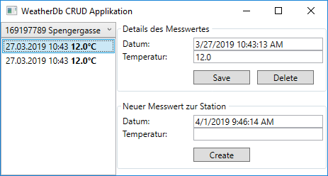

# WeatherDb CRUD Applikation
 
Symbolfoto, die Applikation kann abweichen.

## Einbinden der Datenbank
Lege mit Hilfe des SQL Dumps in [WeatherDbDump.sql auf Github](https://github.com/schletz/Pos3xhif/tree/master/DB%20-%20EntityFramework)
im SQL Server Management Studio die Datenbank an. Falls du schon
eine Datenbank *WeatherDb* hast, lösche diese im Management Studio und erstelle danach eine neue, leere
Datenbank. Führe dann den Dump aus, achte aber darauf, dass du in der richtigen Datenbank bist. Erstelle 
dann im Musterprojekt im Ordner *Model* die entsprechenden Modelklassen mit dem ADO.NET 
Assistenten.

## Anpassen des ViewModels
Das Viewmodel ist noch leer. Die Bindings sind im XAML Code allerdings schon angelegt, d. h. du musst
einmal nachsehen, auf welche Properties im XAML Code verwiesen wird. Erstelle diese im ViewModel und
programmiere die entsprechende Logik dahinter.

## Eventhandler für Save, Delete und Create
Im XAML Code sind für diese Buttons klassische Eventhandler im code behind vorgegeben. Du kannst stattdessen 
aber auch RelayCommand nutzen. Eine Implementierung von *RelayCommand.cs* ist in der [ViewModel Demo App aif Github](https://github.com/schletz/Pos3xhif/tree/master/WPF/02%20ViewModelDemoApp/ViewModelDemoApp/ViewModels) 
enthalten. Unter [02 CRUD auf Github](https://github.com/schletz/Pos3xhif/tree/master/DB%20-%20EntityFramework/02%20CRUD)
steht, wie Datensätze eingefügt, verändert oder gelöscht werden können.

## Anlegen neuer Werte: Der Bereich "Neuer Messwert"
Die Textfelder im Bereich "Neuer Messwert" sind an eine eigene Instanz von Station (*NewStation*) im Viewmodel
gebunden. Das Datum soll mit der aktuellen Systemzeit initialisiert werden. Dafür verwende die Methode
*GetCurrentTime()*, die die aktuelle Systemzeit auf Sekunden genau liefert.

## Bewertung (fiktiv)
Wenn diese Aufgabe eine Prüfung wäre, würden folgende Erwartungen für die einzelnen Noten gelten:

| Note | Erwartung |
| ---- | --------- |
| Genügend     | Beim Starten der Applikation wird das Dropdownfeld mit allen Stationen gefüllt. Beim Wählen einer Station erscheinen in der Liste die Messwerte.
| Befriedigend | Beim Klicken auf einen Messwert werden die Textfelder im Bereich "Details des Messwertes" mit den angeklickten Werten befüllt.
| Gut          | Speichern und Löschen des Messwertes funktionieren. Die Listen werden auch nach dem Einfügen und Löschen aktualisiert.
| Sehr gut     | Das Neuanlegen funktioniert. Nach dem Anlegen werden die Listen aktualisiert und die Textfelder werden wieder mit dem neuen Systemdatum initialisiert.
