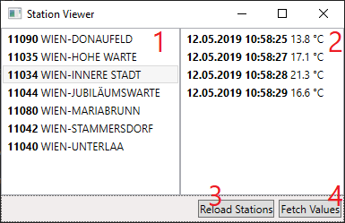

## Intro


Die ZAMG (Zentralanstalt für Meteorologie und Geodynamik) betreibt ein Messnetz von 273 Stationen (Stand: 1.1.2019).
Es soll ein Programm geschrieben werden, welches die aktuellen Messwerte dieser Stationen abruft und in
eine Datenbank schreibt. Das Abrufen der Daten und Schreiben in die Datenbank soll dabei asynchron stattfinden,
damit die Benutzeroberfläche nicht einfriert.

Die Liste aller Stationen kann von der URL *http://schletz.org/getStations* als JSON Dokument geladen
werden. Es hat die Properties ID (Stations-ID), NAME, (Name der Station), BUNDESLAND, LAENGE (Längengrad), 
BREITE (Breitengrad) und HOEHE (Seehöhe). 

Die aktuellen Messdaten von Wien können unter der URL *http://schletz.org/fetchData?state=WIE* abgerufen
werden, die von ganz Österreich unter *http://schletz.org/fetchData*. Es handelt sich dabei um Testdaten,
die Properties des JSON Dokumentes sind STATION (Stations-ID), TIME (Messzeitpunkt) und TT (Lufttemperatur 
in °C)

Das Programm soll folgende Features haben:

1. **Liste der Stationen**: Diese Liste stellt die Datensätze in der Tabelle *Station* dar. Beim Klicken
   auf einen Eintrag werden die Werte in (2) angezeigt.
2. **Liste mit den Messwerten**: Diese Liste stellt die gespeicherten Messwerte in der Tabelle *Value* 
   dar.
3. **Button Reload Stations**: Mit diesem Button kann der Anwender die Liste der Stationen neu laden.
   Die Daten werden daraufhin in der Tabelle Station gespeichert bzw. ergänzt und die Liste (1) wird aktualisiert.
4. **Button Fetch Values**: Mit diesem Button kann der Anwender die neuesten Messwerte aller Stationen
   abrufen. Sie werden daraufhin in der Tabelle Value gespeichert und die Liste (2) wird aktualisiert.

## Erstellen der Datenbank
Erstelle eine Datenbank mit dem Namen *StationDb*. Die Tabellen und Inhalte können mittels eines SQL 
Skriptes in der Datei *StationDb.sql* (liegt im Visual Studio Projekt) im SQL Server Management Studio 
(SSMS) erstellt werden. Es hat folgenden Inhalt:
```sql
USE StationDb;
GO
IF (OBJECT_ID('Value', 'U')) IS NOT NULL DROP TABLE Value;
IF (OBJECT_ID('Station', 'U')) IS NOT NULL DROP TABLE Station;

CREATE TABLE Station (
	ID         INTEGER PRIMARY KEY,
	NAME       VARCHAR(60) NOT NULL,
	BUNDESLAND VARCHAR(10) NOT NULL,
	LAENGE     FLOAT NOT NULL,
	BREITE     FLOAT NOT NULL,
	HOEHE      FLOAT NOT NULL
);

CREATE TABLE Value (
	STATION INTEGER FOREIGN KEY REFERENCES Station(ID),
	TIME    DATETIME,
	TT      FLOAT NOT NULL,
	PRIMARY KEY (STATION, TIME)
);

TRUNCATE TABLE Value;
DELETE FROM Station;
INSERT [dbo].[Station] ([ID], [NAME], [BUNDESLAND], [LAENGE], [BREITE], [HOEHE]) VALUES (11034, N'WIEN-INNERE STADT', N'WIE', 16.36694336, 48.19833374, 177)
INSERT [dbo].[Station] ([ID], [NAME], [BUNDESLAND], [LAENGE], [BREITE], [HOEHE]) VALUES (11035, N'WIEN-HOHE WARTE', N'WIE', 16.35638809, 48.24861145, 198)
INSERT [dbo].[Station] ([ID], [NAME], [BUNDESLAND], [LAENGE], [BREITE], [HOEHE]) VALUES (11040, N'WIEN-UNTERLAA', N'WIE', 16.41944313, 48.125, 200)
INSERT [dbo].[Station] ([ID], [NAME], [BUNDESLAND], [LAENGE], [BREITE], [HOEHE]) VALUES (11042, N'WIEN-STAMMERSDORF', N'WIE', 16.40555573, 48.30583191, 191)
INSERT [dbo].[Station] ([ID], [NAME], [BUNDESLAND], [LAENGE], [BREITE], [HOEHE]) VALUES (11044, N'WIEN-JUBILÄUMSWARTE', N'WIE', 16.26527786, 48.2211113, 450)
INSERT [dbo].[Station] ([ID], [NAME], [BUNDESLAND], [LAENGE], [BREITE], [HOEHE]) VALUES (11080, N'WIEN-MARIABRUNN', N'WIE', 16.2294445, 48.20694351, 225)
INSERT [dbo].[Station] ([ID], [NAME], [BUNDESLAND], [LAENGE], [BREITE], [HOEHE]) VALUES (11090, N'WIEN-DONAUFELD', N'WIE', 16.43138885, 48.25722122, 160)
```

## Implementierung und das Musterprojekt
Öffne das Musterprojekt über die Datei *StationViewer.sln* in Visual Studio. Erstelle dabei das Projekt
nach dem Laden, um alle Pakete nachzuladen. Im Musterprojekt ist die Oberfläche und das Model bereits
vollständig vorhanden, hier müssen keine Änderungen gemacht werden. Bei einem anderen Instanznamen ist
ggf. der Connection String in der Datei *App.config* zu ändern.

In der Datenbank befinden sich bereits die Stationen von Wien, gehe daher bei der Implementierung schrittweise
vor:

1. Das erste Ziel ist das Laden der aktuellen Messwerte aus Wien mittels des Buttons *Fetch Values* von    
   *http://schletz.org/fetchData?state=WIE*.
2. Danach implementiere den Button *Reload Stations*, die die Stationen von *http://schletz.org/getStations* 
   ergänzt. 
3. Wenn das funktioniert, kannst du mittels *Fetch Values* nicht nur die Daten aus Wien, sondern auch
   die Daten aus ganz Österreich von *http://schletz.org/fetchData* laden.
   
Die Eventhandler der Buttons sind in *MainWindow.xaml.cs* schon angelegt. Bei den Methoden gibt es weitere
Hinweise zur Umsetzung. In *MainViewModel.cs* müssen die asynchronen Methoden *FetchValues()* und *LoadStations()*
implementiert werden. Auch hier gibt es bei den Methodenbeschreibungen weitere Hinweise.

## Beurteilung
| Note | Leistung   |
| ---- | ---------- | 
| Genügend | Der Button *Fetch Values* lädt die Daten der Wiener Stationen asynchron und schreibt diese asynchron in die Tabelle Value. |
| Befriedigend | Zusätzlich wird die Anzeige nach dem Laden korrekt aktualisiert, die neuen Werte sind nach dem Laden sichtbar. Die Statuszeile wird wie definiert befüllt. |
| Gut | Zusätzlich wird mittels des Buttons *Reload Stations* das Stationsverzeichnis asynchron geladen und die Tabelle Station wird asynchron mit den geladenen und noch nicht vorhandenen Datensätzen ergänzt. |
| Sehr gut | Zusätzlich lädt *Fetch Values* nicht nur die Daten aus Wien, sondern auch von ganz Österreich. Dabei werden Fehler durch fehlende Stationen abgefangen, da geprüft wird, ob sich die Station schon in der Datenbank befindet. |

Viel Erfolg!