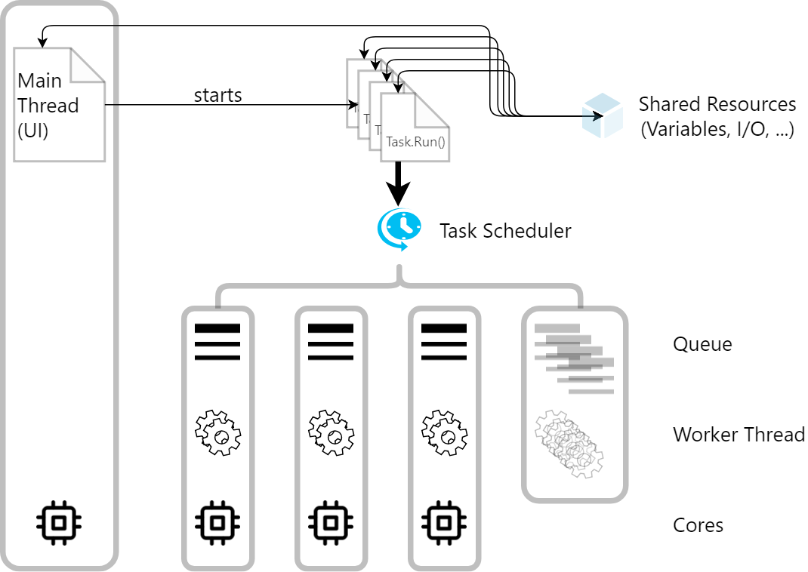

---
output:
  ioslides_presentation: default
  html_document: default
  word_document: default
  pdf_document: default
---
# TPL - Die Task Parallel Library in C#
Mit dem .NET Framework 4.0 wurde die nebenläufige Programmierung durch die Einführung von Tasks wesentlich
vereinfacht. Früher musste man händisch Threads starten, diese Synchronisieren und in einem Threadpool
verwalten. Heute ist das "rohe" Erstellen von Threads nicht mehr notwendig. Code im Internet, der dies
noch macht, ist meist sehr alt und sollte nicht mehr verwendet werden.

Threads kommen natürlich auch heute noch vor. Sie sind die darunterliegende, im Betriebssystem verankerte
Basis für Tasks in C#. Folgende Abbildung zeigt die Abhängigkeiten zwischen diesen Komponenten:

Grafik erstellt in [draw.io]

Wird ein Task (also eine Funktion, die nebenläufig ausgeführt werden soll) erstellt, so verteilt der 
Task Scheduler diese Funktion auf die bestehenden *Worker Threads*, die sie dann auf einem CPU Kern
ausführen. Beim Start der Applikation gibt es bereits mehrere Worker Threads, da das Erstellen eines
neuen Threads mit einem Overhead verbunden ist. In manchen Fällen werden zusätzliche Threads erstellt,
etwa, wenn hauptsächlich auf Eingabedaten gewartet wird und die CPU daher nicht ausgelastet ist.

Der Vorteil der TPL ist, dass sich der Programmierer darum nicht mehr im Detail kümmern muss. Um das
Verhalten aber zu verstehen, ist der Zusammenhang zwischen Worker Thread und Task sehr wichtig.

Threads und Tasks werden oft als Synonym verwendet. Genauer betrachtet sind Tasks nur Methoden, also
"Arbeitspakete", die ausgeführt werden sollen. Diese werden dann einem Thread zugewiesen und ausgeführt.
Dementsprechend gibt es in .NET auch 2 Namespaces: *System.Threading.Tasks* stellt Methoden für das Erstellen 
und Verwalten dieser Arbeitspakete bereit, die Methoden von *System.Threading* kümmern sich um die Verwaltung
der darunterliegenden Threads.

## Szenarien von Tasks

| Aufgabe | Lösung |
|---------|--------|
| CPU intensive Aufgaben sollen parallel ausgeführt werden. | *Parallel.For()* und *Parallel.ForEach()* führen Funktionen parallel aus und warten, bis alle Funktionen beendet sind. |
| Auf eine I/O Operation soll gewartet werden, ohne dass das UI einfriert. | Verwenden von *await* und *async* in Verbindung mit den vordefinierten *...Async()* Methoden des Frameworks. |
| Ein Hintergrundtask soll dauernd laufen (z. B. Netzwerkscan) | Einmaliges Erstellen mit *Task.Run()* (Option *TaskCreationOptions.LongRunning*). Datenaustausch mit dem event-based asynchronous pattern, beenden mit *CancellationToken*. |
| Mehrere I/O Operationen sollen parallel ausgeführt werden. | Je nach konkreter Situation unterschiedlich. Setzen von *ParallelOptions.MaxDegreeOfParallelism* in Parallel. Starten der *...Async()* Methoden in einer Schleife und verwenden von *SemaphoreSlim* zur Begrenzung der Ausführung. Verwenden von TPL Dataflow. |
| Producer und Consumerszenarien sollen abgebildet werden. | Verwenden von TPL Dataflow, um ganze Verarbeitungsnetze abbilden zu können (z. B. Lesen vom Netz, lokales Verarbeiten und Schreiben in die Datenbank). |

## Häufige Fehler bei Tasks
Auch wenn die TPL sehr viel Komfort bietet, muss ein Grundverständnis des Task Schedulers trotzdem vorhanden
sein. Tasks können nicht zaubern, und daher sind Fehler, die bei der klassischen Threadprogrammierung
gemacht werden können, auch bei Tasks gültig. Folgende Fehler treten in der Praxis häufig auf und sind
weit häufiger als der bekannte "Deadlock":

- **Schreibender Zugriff auf gemeinsame Variablen** ohne *lock()*. Fehler treten hier oft nur sporadisch auf
  und sind daher schwer zu finden. Bei Collections können die threadfähigen Collections im .NET Framework
  wie *ConcurrentBag* oder *ConcurrentQueue* verwendet werden, um sich den manuellen lock zu ersparen.
- **Aufruf von nicht threadsicheren Methoden** von gemeinsamen Instanzen. *Random.Next()* ist zum Beispiel
  nicht thread safe und liefert ein undefiniertes Verhalten! Daher muss immer in der Dokumentation nachgelesen
  werden, ob die Methode auch threadsicher ist.
- **Fehlende Begrenzung für I/O Tasks.** Es werden zu viele Verbindungen zum Server aufgebaut, der diese dann
  ablehnt. Außerdem kann es zu wenig Speicher für zu viele Tasks geben. Wenn gleichzeitig 10 Dateien 
  gelesen und verarbeitet werden, müssen diese auch im Hauptspeicher Platz haben. Das Festlegen des Limits
  kann hier durchaus komplex sein, da Dateien in der Größe sehr unterschiedlich sein können.
- **Blockierende Methoden werden in *Task.Run()* "gepackt"** und so scheinbar asynchron gemacht. Im Hintergrund
  wird dann ein Worker Thread verwendet, der nur wartet und nicht für andere Aufgaben zur Verfügung steht.
  Daher sind die *...Async()* Methoden des .NET Frameworks in Verbindung mit *await*/*async* zu verwenden. 
  Gibt es keine, entsprechende Methode (alte Frameworkmethoden), kann mit *TaskCompletionSource* gearbeitet 
  werden (seltenes Szenario).
- ***await Task.Run()* als einzige Anweisung** in einer asynchronen Methode. Hier kann gleich der Task zurückgegeben werden, da sonst ein Task erstellt wird, der nur auf das Ende des anderen Tasks wartet.
- **Parallel wird für blockierende I/O Aufgaben verwendet.** Hier werden zusätzliche Threads erstellt, die nur warten.
- **Überparallelisierung.** Es wird jede kleine Anweisung in *Task.Run()* gepackt. Dabei ist dann der overhead
  größer und das Programm sogar langsamer als die synchrone Variante.

## Weiterführende Links:
- [Async in depth](https://docs.microsoft.com/de-de/dotnet/standard/async-in-depth)
- [Async/Await - Best Practices in Asynchronous Programming](https://msdn.microsoft.com/en-us/magazine/jj991977.aspx)

[draw.io]: https://draw.io
