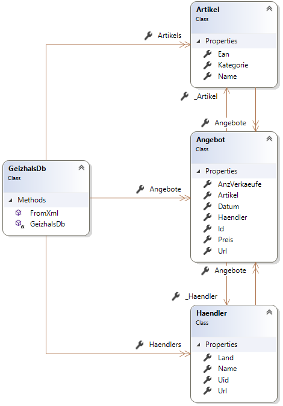

# Geizhals Artikelfinder


Basierend auf der Übungsprüfung soll nun eine Suchmaske für die gespeicherten Artikel erstellt
werden. Nach Eingabe einer Artikelnummer (EAN) soll das Programm den billigsten,
den durchschnittlichen und den maximalen Preis im eingegebenen Zeitraum suchen.

In der Datei *Geizhals.xml* sind die Rohdaten gespeichert, hier kannst du zum Testen gültige EAN Nummern
finden. Die Programmausgabe für den Artikel *1000005* soll dem oberen Screenshot exakt entsprechen.

Beachte für die Datumsfelder folgendes: Die Datumfsfelder begrenzen den Suchzeitraum für die Preise. Wenn z. B. 
*14.11.2018* als Wert für Datum ab und *16.11.2018* als Wert für Datum bis eingegeben wurde, dann
sollen nur die Angebote vom 14., 15. und 16.11.2018 berücksichtigt werden. Wird in einem Datumfsfeld nichts
oder ein ungültiger Wert eingegeben, so wird der Filter ignoriert. Das bedeutet, dass die Suche dann nach
unten bzw. oben nicht beschränkt wird.

## Implementierung
Im Musterprojekt ist das Model bereits fertig enthalten. Mit der Methode *GeizhalsDb.FromXml()* kann
eine Instanz der Datenbank erstellt werden. Der Zugriff mittels LINQ kann dann z. B. so aussehen:
```c#
GeizhalsDb db = GeizhalsDb.FromXml("Geizhals.xml");
from a in db.Artikels
where a.Ean == 1
select new
{
    Ean = a.Ean,
    Name = a.Name
};
```

Das vollständige Klassenmodell ist hier abgebildet:



### Implementierung des ViewModels

Erstelle im ViewModel eine Instanz der Datenbank. Diese soll am Anfang nur einmal erstellt werden, und nicht
bei jeder Abfrage. Für das Binding der Filterfelder sind schon string Properties vorgegeben. Für das Binding
der Ergebnisausgabe verwende den in der Datei *MainViewModel.cs* enthaltenen Typ *Articledata*.

Die Methode *SearchArticle()* führt die Suche nach den Artikeldaten durch. Sie setzt das Property *CurrentArticle*
vom Typ *Articledata* mit den über LINQ herausgefundenen Werten.

Die Klasse *RelayCommand* für die Erstellung von ICommand Properties ist ebenfalls fertig enthalten. Weise
dem Property *ArticleSearchCommand* im Konstruktor eine Instanz von *RelayCommand* zu, sodass die Methode
*SearchArticle()* beim Klick auf den Button aufgerufen wird.

### Implementierung der Bindings in XAML

Das Layout in XAML ist schon fertig vorgegeben, allerdings sind noch Platzhaltertexte verwendet worden.
Verwende Bindings, um mit dem ViewModel kommunizieren zu können. Für die formatierte Ausgabe des Betrages
verwende ein Binding mit einem StringFormat. Als Format ist *StringFormat={}{0:0.00} €}* zu verwenden.