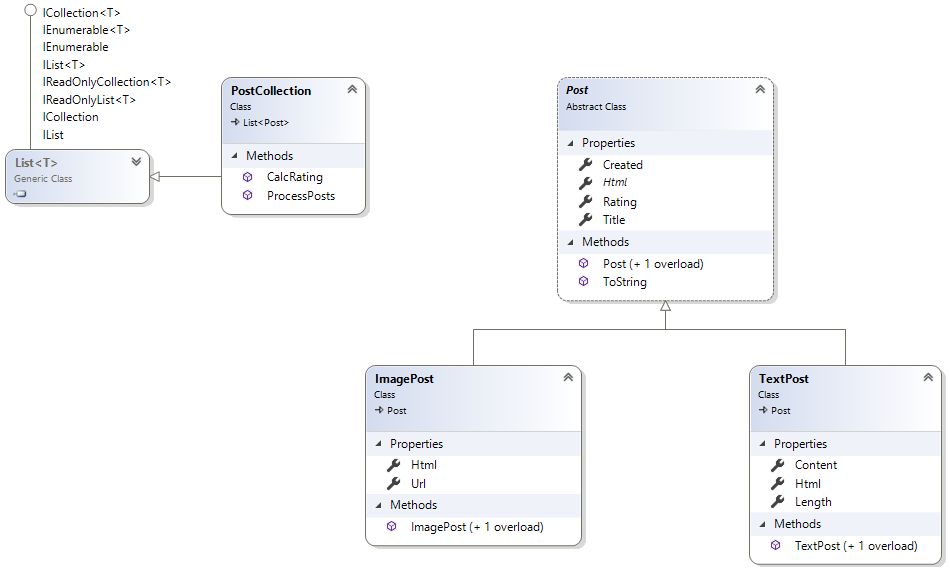

# 1. Praktische LF in C#
Klasse: 3BHIF
Datum: 13. November 2019
Prüfer: SZ

## Aufgabenstellung
Implementiere ein Klassenmodell für ein Forum. Es können 2 Arten von Postings veröffentlicht
werden: Text und Bildbeiträge.

1. Die Abstrakte Klasse *Post* ist Basis für *TextPost* und *ImagePost*. Sie hat ein read-only Property
   *Title* (string), ein read-only Property *Created* (DateTime) und ein Defaultproperty *Rating* (int).
    1. Es gibt 2 Konstruktoren, einer befüllt die Properties *Title* und *Created* mit den übergebenen Werten,
       der 2. Konstruktor bekommt nur einen Titel und setzt *Created* auf die aktuelle Systemzeit (DateTime.Now).
    1. Es soll ein abstraktes read-only Property *Html* (string) definiert werden, welches in den abgeleiteten
       Klassen die HTML Ausgabe zurückgibt.
    1. Überschreibe die *ToString()* Methode, sodass sie das Property *Html* zurückgibt.

2. Die Klasse *TextPost* hat 2 zusätzliche Properties:
    1. *Content* (string) als Defaultproperty. Es soll den eingegebenen Text speichern.
    1. *Length* (int) als read-only Property. Es soll die Länge des eingegebenen Contents liefern. Beachte,
       dass der Content auch NULL sein darf. In diesem Fall ist die Länge 0 zu liefern.
    1. Das Property *Html* soll so überschrieben werden, dass der Content in `
` eingeschlossen wird.
       Text wird also als `
Text
` zurückgegeben.

3. Die Klasse *ImagePost* hat folgende Features:
    1. Ein default Property *Url* (string), welches die Url des Bildes speichern kann.
    1. Das Property *Html* soll so überschrieben werden, dass die Url in `` verpackt wird.
       http://bild.png wird also als `` zurückgegeben.

4. Implementiere zudem eine Klasse *PostCollection*, die eine Liste von Posts implementiert (also von diesem
   Typ erbt). Implementiere 2 Methoden:
    1. Die Methode *ProcessPosts* soll eine Lambda Expression übergeben bekommen, die diese Funktion einfach
       für jedes Post Element der Liste aufruft.
    1. Die Methode *CalcRating* bekommt eine Konverterfunktion übergeben. Diese Funktion bildet ein
       Post Element auf einen int Wert ab. Dieser zurückgegebene Wert soll dann aufsummiert und
       zurückgegeben werden.

## Unittests
Im Programm sind Tests enthalten, die diese Funktionen prüfen. Orientiere dich bei deiner Programmierung
an diesen Tests. Im Zweifelsfall gilt das Verhalten des Tests als "richtig". Das Programm muss natürlich
beim Tauschen der Testdaten ebenfalls funktionieren. Ein Zurückliefern statischer Werte ist daher nicht
möglich. 

Es ist erlaubt, einen Test auszukommentieren, falls dieser einen Laufzeitfehler verursacht. Ansonsten 
dürfen die Tests natürlich nicht verändert werden.

Die Beurteilung wird im Programm am Ende der Tests ausgegeben.

## Abgabe
Die Solution ist ohne die Ordner *bin* und *obj* auf
\\enterprise\ausbildung\unterricht\abgaben\3BHIF\POS_SZ\PLF20191114
in den entsprechenden persönlichen Ordner ungepackt zu kopieren.