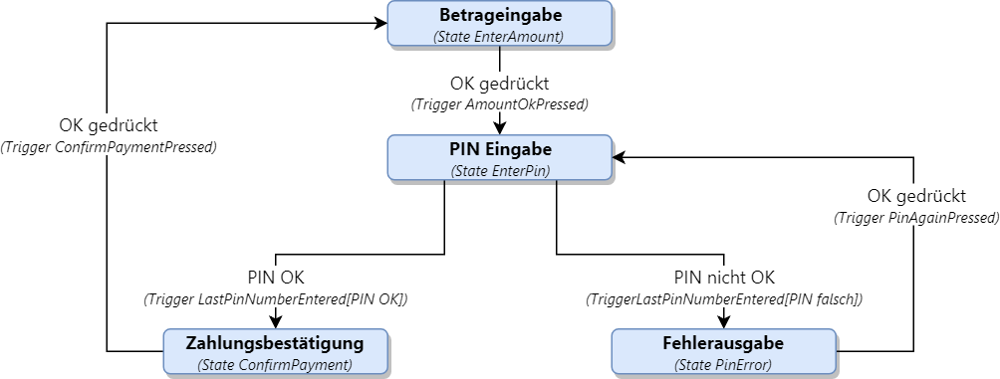

# Mustercode: Benutzeroberflächen als State Machine auffassen

Mit Hilfe einer State Machine können die verschiedenen Zustände einer Benutzeroberfläche (ein- und ausgeblendete Inhalte, 
aktivierte und deaktivierte Steuerelemente, ...) elegant programmiert werden. Das nuget Paket [stateless] stellt hierfür die Klasse 
StateMachine bereit, die verschiedene States und Trigger, die den Übergang zwischen den States hervorrufen, verwalten kann. 
Dieses Beispiel implementiert ein Kassenterminal für Bankomatkarten. Es gibt bei dieser kleinen Applikation bereits recht viele 
mögliche Zustände:

Grafik gezeichnet mit [draw.io]

In *MainViewModel* werden diese Zustände und Trigger als enum Werte abgebildet:
```c#
public enum States
{
    EnterAmount, EnterPin, ConfirmPayment, PinError
}

public enum Triggers
{
    AmountOkPressed, ConfirmPaymentPressed, PinAgainPressed, LastPinNumberEntered
}
```

Die eigentliche StateMachine wird in *MainViewModel.InitStateMachine()* definiert:
```c#
private void InitStateMachine()
{
    stateMachine.Configure(States.EnterAmount)
        .OnEntry(() =>
        {
            // Den zu zahlenden Betrag wieder auf 0 setzen.
            SetProperty(nameof(Amount), default(decimal?));
        })
        .Permit(Triggers.AmountOkPressed, States.EnterPin);

    stateMachine.Configure(States.EnterPin)
        .OnEntry(() =>
        {
            // Den PIN wieder leer machen.
            SetProperty(nameof(Pin), default(int));
        })
        // Bedingter Übergang, wenn der PIN gültig ist (1234) wird zu ConfirmPayment
        // gewechselt.
        .PermitIf(Triggers.LastPinNumberEntered, States.ConfirmPayment, () => Pin == 1234)
        .PermitIf(Triggers.LastPinNumberEntered, States.PinError, () => Pin != 1234);

    stateMachine.Configure(States.ConfirmPayment)
        .Permit(Triggers.ConfirmPaymentPressed, States.EnterAmount)
        // Wird die Zahlung bestätigt, wird ein Log Eintrag im Model erstellt.
        .OnExit(() => TransactionLog.Transactions.Add(new Transaction
            {
                Amount = Amount ?? 0
            }));

    stateMachine.Configure(States.PinError)
        .Permit(Triggers.PinAgainPressed, States.EnterPin);

    stateMachine.OnTransitioned((t) =>
    {
        // Wird der State verändert, benachrichtigt dies alle Controls, 
        // dessen Sichtbarkeit vom State abhängen.
        PropertyChanged(this, new PropertyChangedEventArgs(nameof(State)));
    });
}
```
[stateless]: https://www.nuget.org/packages/Stateless/
[draw.io]: https://www.draw.io/
